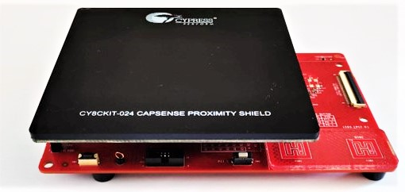
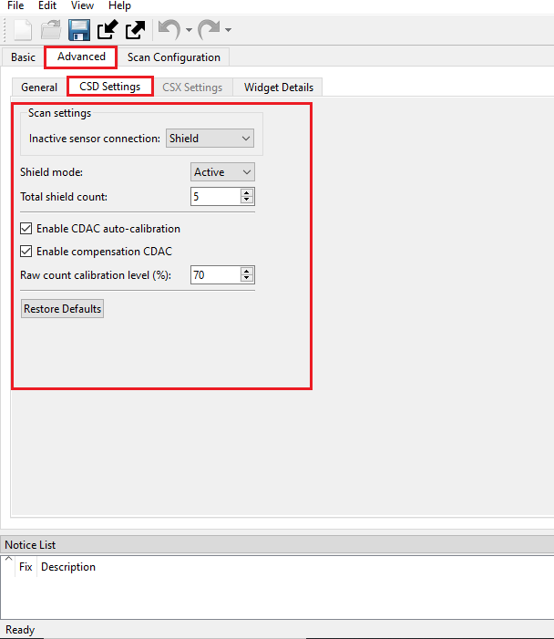

# PSoC&trade; 4: CAPSENSE&trade; liquid-tolerant proximity

This code example demonstrates to tune the proximity sensors on [CY8CKIT-024](https://www.infineon.com/CY8CKIT-024) proximity shield for liquid tolerance. This code example is tuned for a proximity-sensing distance of 3 cm with liquid tolerance. The proximity of the user hand is indicated by turning ON the LEDs (LED1-LED5).

[View this README on GitHub.](https://github.com/Infineon/mtb-example-psoc4-capsense-liquid-tolerant-proximity)

[Provide feedback on this code example.](https://cypress.co1.qualtrics.com/jfe/form/SV_1NTns53sK2yiljn?Q_EED=eyJVbmlxdWUgRG9jIElkIjoiQ0UyMzc2ODYiLCJTcGVjIE51bWJlciI6IjAwMi0zNzY4NiIsIkRvYyBUaXRsZSI6IlBTb0MmdHJhZGU7IDQ6IENBUFNFTlNFJnRyYWRlOyBsaXF1aWQtdG9sZXJhbnQgcHJveGltaXR5IiwicmlkIjoicmFqYW5uYWdhdXRhIiwiRG9jIHZlcnNpb24iOiIxLjEuMCIsIkRvYyBMYW5ndWFnZSI6IkVuZ2xpc2giLCJEb2MgRGl2aXNpb24iOiJNQ0QiLCJEb2MgQlUiOiJJQ1ciLCJEb2MgRmFtaWx5IjoiUFNPQyJ9)

## Requirements

- [ModusToolbox&trade;](https://www.infineon.com/modustoolbox) v3.1 or later (tested with v3.1)

- Board support package (BSP) minimum required version: 3.1.0
- Programming language: C
- Associated parts: [PSoC&trade; 4500S, and PSoC&trade; 4100S Max](https://www.infineon.com/cms/en/product/microcontroller/32-bit-psoc-arm-cortex-microcontroller/psoc-4-32-bit-arm-cortex-m0-mcu/)

## Supported toolchains (make variable 'TOOLCHAIN')

- GNU Arm&reg; Embedded Compiler v11.3.1 (`GCC_ARM`) – Default value of `TOOLCHAIN`
- Arm&reg; Compiler v6.16 (`ARM`)
- IAR C/C++ Compiler v9.30.1 (`IAR`)

## Supported kits (make variable 'TARGET')

- [PSoC&trade; 4100S Max Pioneer Kit](https://www.infineon.com/CY8CKIT-041S-MAX) (`CY8CKIT-041S-MAX`) - Default value of `TARGET`
- [PSoC&trade; 4500S Pioneer Kit](https://www.infineon.com/CY8CKIT-045S) (`CY8CKIT-045S`)

## Hardware setup

1. To test the code example with the supported kits, connect the [CY8CKIT-024](https://www.infineon.com/CY8CKIT-024) proximity shield, as shown in **Figure 1**. The [CY8CKIT-024](https://www.infineon.com/CY8CKIT-024) proximity shield is connected to the J1, J2, J3, and J4 Arduino-compatible headers of [CY8CKIT-041S-MAX](https://www.infineon.com/CY8CKIT-041S-MAX) and [CY8CKIT-045S](https://www.infineon.com/CY8CKIT-045S) boards.

2. On [CY8CKIT-024](https://www.infineon.com/CY8CKIT-024), slide the SW1 to select SHIELD to drive the GND/SHIELD loop and the bottom hatch pattern with the driven shield signal. **Table 1** lists the pin connections for the kits.

   **Figure 1. Hardware connection of [CY8CKIT-024](https://www.infineon.com/CY8CKIT-024) shield with [CY8CKIT-041S-MAX](https://www.infineon.com/CY8CKIT-041S-MAX)** 

   

**Table 1:** Pin mapping for  [**CY8CKIT-024**](https://www.infineon.com/CY8CKIT-024) with [**CY8CKIT-041S-MAX**](https://www.infineon.com/CY8CKIT-041S-MAX) and [**CY8CKIT-045S**](https://www.infineon.com/CY8CKIT-045S)

Digital pin  | CY8CKIT-024 | CY8CKIT-041S-MAX | CY8CKIT-045S |
 :------- | :------------    | :-----------  | :------------ |
 PROXY_sensor | PROX | P6[0] | P2[3] |
 PS1 | PS1 | P10[2] | P5[2] |
 PS2 | PS2 | P8[0] | P2[4] |
 PS3 | PS3 | P2[1] | P3[1] |
 PS4 | PS4 | P6[2] | P5[7] |
 Cmod |  -  | -    | P4[1] |
 Cmod1 | -  | P4[0] | - |
 Cmod2 | -  | P4[1] | - |
 CYBSP_J4_2  | SHIELD | P8[1] | P2[5] |
 LED1   | LED1 | P10[5] | P2[1] |
 LED2   | LED2 | P10[4] | P2[2] |
 LED3   | LED3 | P8[2] | P5[5] |
 LED4   | LED4 | P6[3] | P2[0] |
 LED5   | LED5 | P2[0] | P3[0] |
 EzI2C:SCL | - | P1[0] | P1[0] |
 EzI2C:SDA | - | P1[1]| P1[1] |
 
 See the kit guide to ensure that the board is configured correctly to VDDA at 5 V (power selection jumper should be at position 1 and 2). If you are using the code example at a VDDA voltage other than 5 V, ensure to set up the device power voltages correctly for the proper operation of the device power domains.
 
 ### Board rework on [CY8CKIT-045S](https://www.infineon.com/CY8CKIT-045S)
 
 For [CY8CKIT-045S](https://www.infineon.com/CY8CKIT-045S), pins P2[4] and P2[5] are configured as CYBSP_DEBUG_UART_RX and CYBSP_DEBUG_UART_TX. To use these pins for [CY8CKIT-024](https://www.infineon.com/CY8CKIT-024), remove resistors R27 and R26.
 
> **Note:** Few PSoC&trade; 4 kits ship with KitProg2 installed. ModusToolbox&trade; requires KitProg3. Before using this code example, make sure that the board is upgraded to KitProg3. The tool and instructions are available in the [Firmware Loader](https://github.com/Infineon/Firmware-loader) GitHub repository. If you do not upgrade, you will see an error like "unable to find CMSIS-DAP device" or "KitProg firmware is out of date".

## Software setup

See the [ModusToolbox&trade; tools package installation guide](https://www.infineon.com/ModusToolboxInstallguide) for information about installing and configuring the tools package.

This example requires no additional software or tools.

## Using the code example

### Create the project

The ModusToolbox&trade; tools package provides the Project Creator as both a GUI tool and a command line tool.

<details><summary><b>Use Project Creator GUI</b></summary>

1. Open the Project Creator GUI tool.

   There are several ways to do this, including launching it from the dashboard or from inside the Eclipse IDE. For more details, see the [Project Creator user guide](https://www.infineon.com/ModusToolboxProjectCreator) (locally available at *{ModusToolbox&trade; install directory}/tools_{version}/project-creator/docs/project-creator.pdf*).

2. On the **Choose Board Support Package (BSP)** page, select a kit supported by this code example. See [Supported kits](#supported-kits-make-variable-target).

   > **Note:** To use this code example for a kit not listed here, you may need to update the source files. If the kit does not have the required resources, the application may not work.

3. On the **Select Application** page:

   a. Select the **Applications(s) Root Path** and the **Target IDE**.

   > **Note:** Depending on how you open the Project Creator tool, these fields may be pre-selected for you.

   b.	Select this code example from the list by enabling its check box.

   > **Note:** You can narrow the list of displayed examples by typing in the filter box.

   c. (Optional) Change the suggested **New Application Name** and **New BSP Name**.

   d. Click **Create** to complete the application creation process.

</details>

<details><summary><b>Use Project Creator CLI</b></summary>

The 'project-creator-cli' tool can be used to create applications from a CLI terminal or from within batch files or shell scripts. This tool is available in the *{ModusToolbox&trade; install directory}/tools_{version}/project-creator/* directory.

Use a CLI terminal to invoke the 'project-creator-cli' tool. On Windows, use the command-line 'modus-shell' program provided in the ModusToolbox&trade; installation instead of a standard Windows command-line application. This shell provides access to all ModusToolbox&trade; tools. You can access it by typing "modus-shell" in the search box in the Windows menu. In Linux and macOS, you can use any terminal application.


The following example clones the "[PSoC&trade; 4: CAPSENSE&trade; liquid-tolerant proximity](https://github.com/Infineon/mtb-example-psoc4-capsense-liquid-tolerant-proximity)" application with the desired name "LiquidTolerantProximity" configured for the [*CY8CKIT-041S-MAX*](https://www.infineon.com/CY8CKIT-041S-MAX) BSP into the specified working directory, *C:/mtb_projects*:

   ```
   project-creator-cli --board-id CY8CKIT-041S-MAX --app-id cce-mtb-psoc4-capsense-proximity --user-app-name LiquidTolerantProximity --target-dir "C:/mtb_projects"
   ```
The 'project-creator-cli' tool has the following arguments:

Argument | Description | Required/optional
---------|-------------|-----------
`--board-id` | Defined in the <id> field of the [BSP](https://github.com/Infineon?q=bsp-manifest&type=&language=&sort=) manifest | Required
`--app-id`   | Defined in the <id> field of the [CE](https://github.com/Infineon?q=ce-manifest&type=&language=&sort=) manifest | Required
`--target-dir`| Specify the directory in which the application is to be created if you prefer not to use the default current working directory | Optional
`--user-app-name`| Specify the name of the application if you prefer to have a name other than the example's default name | Optional

> **Note:** The project-creator-cli tool uses the `git clone` and `make getlibs` commands to fetch the repository and import the required libraries. For details, see the "Project creator tools" section of the [ModusToolbox&trade; tools package user guide](https://www.infineon.com/ModusToolboxUserGuide) (locally available at {ModusToolbox&trade; install directory}/docs_{version}/mtb_user_guide.pdf).

</details>

### Open the project

After the project has been created, you can open it in your preferred development environment.

<details><summary><b>Eclipse IDE</b></summary>

If you opened the Project Creator tool from the included Eclipse IDE, the project will open in Eclipse automatically.

For more details, see the [Eclipse IDE for ModusToolbox&trade; user guide](https://www.infineon.com/MTBEclipseIDEUserGuide) (locally available at *{ModusToolbox&trade; install directory}/docs_{version}/mt_ide_user_guide.pdf*).

</details>

<details><summary><b>Visual Studio (VS) Code</b></summary>

Launch VS Code manually, and then open the generated *{project-name}.code-workspace* file located in the project directory.

For more details, see the [Visual Studio Code for ModusToolbox&trade; user guide](https://www.infineon.com/MTBVSCodeUserGuide) (locally available at *{ModusToolbox&trade; install directory}/docs_{version}/mt_vscode_user_guide.pdf*).

</details>

<details><summary><b>Keil µVision</b></summary>

Double-click the generated *{project-name}.cprj* file to launch the Keil µVision IDE.

For more details, see the [Keil µVision for ModusToolbox&trade; user guide](https://www.infineon.com/MTBuVisionUserGuide) (locally available at *{ModusToolbox&trade; install directory}/docs_{version}/mt_uvision_user_guide.pdf*).

</details>

<details><summary><b>IAR Embedded Workbench</b></summary>

Open IAR Embedded Workbench manually, and create a new project. Then select the generated *{project-name}.ipcf* file located in the project directory.

For more details, see the [IAR Embedded Workbench for ModusToolbox&trade; user guide](https://www.infineon.com/MTBIARUserGuide) (locally available at *{ModusToolbox&trade; install directory}/docs_{version}/mt_iar_user_guide.pdf*).

</details>

<details><summary><b>Command line</b></summary>

If you prefer to use the CLI, open the appropriate terminal, and navigate to the project directory. On Windows, use the command-line 'modus-shell' program; on Linux and macOS, you can use any terminal application. From there, you can run various `make` commands.

For more details, see the [ModusToolbox&trade; tools package user guide](https://www.infineon.com/ModusToolboxUserGuide) (locally available at *{ModusToolbox&trade; install directory}/docs_{version}/mtb_user_guide.pdf*).

</details>

## Operation

1. Connect the board to your PC using the provided USB cable through the KitProg3 USB connector.

2. Connect [**CY8CKIT-024**](https://www.infineon.com/CY8CKIT-024) CAPSENSE&trade; Proximity Shield to [**CY8CKIT-041S-MAX**](https://www.infineon.com/CY8CKIT-041S-MAX) before programming.   

3. Program the board using one of the following:

   <details><summary><b>Using Eclipse IDE</b></summary>

      1. Select the application project in the Project Explorer.

      2. In the **Quick Panel**, scroll down, and click **\<Application Name> Program (KitProg3_MiniProg4)**.

   </details>

   <details><summary><b>In other IDEs</b></summary>

   Follow the instructions in your preferred IDE.
   
   </details>


   <details><summary><b>Using CLI</b></summary>

     From the terminal, execute the `make program` command to build and program the application using the default toolchain to the default target. The default toolchain is specified in the application's Makefile but you can override this value manually:
      ```
      make program TOOLCHAIN=<toolchain>
      ```

      Example:
      ```
      make program TOOLCHAIN=GCC_ARM
      ```

   </details>

4. After programming, the application starts automatically. 

5. To place the water droplets on the proximity sensor (as **Figure 2** shows), use the liquid dropper provided with [CY8CKIT-024](https://www.infineon.com/CY8CKIT-024). After placing the water droplet, verify that the LEDs (LED1-LED5) do not turn on when water droplets are present on the sensor. Hover your hand over the kit at a distance of 3 cm,as **Figure 3** shows, and verify that the LEDs (LED1-LED5) are turned ON to indicate proximity detection.

   > **Note:** When placing the water droplet, if the hand is within proximity-sensing distance (3 cm), proximity will be detected and the LEDs will be turned ON. The LEDs will be turned off when you remove your hand after placing the water droplet, indicating that the water droplet is not causing false triggers

   **Figure 2. Placing water droplet over proximity sensor**

   

   **Figure 3. Proximity detection in presence of water droplet**

   

### Monitor data using CAPSENSE&trade; tuner

The CAPSENSE&trade; Tuner is a standalone tool included with the ModusToolbox™ software. The tool is used to tune CAPSENSE&trade; applications.

1. Open CAPSENSE&trade; tuner from the 'BSP Configurators' section in the IDE Quick Panel.

   You can also run the CAPSENSE&trade; tuner application standalone from *{ModusToolbox&trade; install directory}/ModusToolbox&trade;/tools_{version}/capsense-configurator/capsense-tuner*. In this case, after opening the application, select **File** > **Open** and open the *design.cycapsense* file of the respective application, which is present in the *{Application root directory}/bsps/TARGET_APP_\<BSP-NAME>/COMPONENT_BSP_DESIGN_MODUS/* folder.

   See the [ModusToolbox&trade; user guide](https://www.infineon.com/ModusToolboxUserGuide) (locally available at *{ModusToolbox&trade; install directory}/docs_{version}/mtb_user_guide.pdf*)for options to open the CAPSENSE&trade; tuner application using the CLI.

2. Ensure that the kit is in CMSIS-DAP Bulk mode (KitProg3 Status LED is ON and not blinking). See [Firmware-loader](https://github.com/Infineon/Firmware-loader) to learn how to update the firmware and switch modes in KitProg3.

3. In the tuner application, click on the **Tuner communication setup** icon or select **Tools** > **Tuner communication setup**. In the window that appears, select the I2C checkbox under KitProg3 and configure as follows:

   - **I2C address:** 8
   - **Sub-address:** 2 bytes
   - **Speed (kHz):** 400

   These are the same values set in the EZI2C resource.

   **Figure 4. Tuner communication setup parameters**
   
   

4. Click **Connect** or select **Communication** > **Connect** to establish a connection.

   **Figure 5. Establish connection**

   

5. Click **Start** or select **Communication** > **Start** to start data streaming from the device.

   **Figure 6. Start tuner communication**

   

   The **Widget/Sensor Parameters** tab is updated with the parameters configured in the CAPSENSE&trade; Configurator window. The tuner displays the data from the sensor in the **Widget View** and **Graph View** tabs.

6. Set the **Read mode** to **Synchronized mode**. Navigate to the **Widget view** tab and notice that the **Proximity0** widget is highlighted in blue when you hover your hand at a distance of 3 cm above the proximity sensor.

   **Figure 7. Widget view of the CAPSENSE&trade; tuner**

   
   
7. Go to the **Graph View** tab to view the raw count, baseline, difference count, and status of a proximity sensor.

   **Figure 8. Graph view of the CAPSENSE&trade; tuner**

   

8. Observe the **Widget/Sensor parameters** section in the CAPSENSE&trade; tuner window as shown in **Figure 7**.

9. Switch to the SNR measurement tab for measuring the SNR and to verify that the SNR is above 5:1, select **Proximity0_Sns0** sensor, and then click **Acquire Noise** as shown in **Figure 9**.

    **Figure 9. CAPSENSE&trade; tuner - SNR Measurement**  
   
    
    
10. Once the noise is acquired, place the hand over the [CY8CKIT-024](https://www.infineon.com/CY8CKIT-024) kit at a distance of 3 cm and then click **Acquire Signal**. Ensure that the hand remains on the same position as long as the signal acquisition is in progress.
 
	The calculated SNR on this button is displayed, as shown in **Figure 10**.

    **Figure 10. CAPSENSE&trade; tuner - SNR measurement**  
   
    
    
11. If the SNR is not above 5:1, increase the **Number of sub-conversions** value until the condition satisfy.

12. If the SNR is above 5:1, switch to the **Graph View** and place the hand over the [CY8CKIT-024](https://www.infineon.com/CY8CKIT-024) kit at a distance of 3 cm, and check the **Sensor Signal** value is above '50' as shown in **Figure 11**.

    **Figure 11. CAPSENSE&trade; tuner - Sensor signal**  
   
    
   
13. If the **Sensor Signal** is not above 50, increase the **Number of sub-conversions** value until the condition satisfy.


## Tuning procedure 

The tuning procedure for the proximity widgets are as follows:

> **Note:** See the section "Manual Tuning" in the [AN92239 - Proximity sensing with CAPSENSE&trade;](http://www.cypress.com/documentation/application-notes/an92239-proximity-sensing-capsense) to learn about the considerations for selecting each parameter values.  **Figure 12** shows the tuning flow of the proximity widget.

   **Figure 12. Proximity widget Tuning flow**
    
   

Do the following to tune the proximity widget:

- [Stage 1: Set initial hardware parameters](#stage-1-set-initial-hardware-parameters)

- [Stage 2: Set sense clock frequency](#stage-2-set-sense-clock-frequency)

- [Stage 3: Fine-tune for required SNR and sensor signal](#stage-3-fine-tune-for-required-snr-and-sensor-signal)

- [Stage 4: Tune threshold parameters](#stage-4-tune-threshold-parameters)

- [Stage 5: Re-tune threshold parameters for liquid tolerance](#stage-5-re-tune-threshold-parameters-for-liquid-tolerance)

### **Stage 1: Set initial hardware parameters**
-------------------------

1. Connect the board to your PC using the provided USB cable through the KitProg3 USB connector.

2. Launch the Device Configurator tool.

   Launch the Device Configurator in Eclipse IDE for ModusToolbox&trade; from the **Tools** section in the IDE Quick Panel or in standalone mode from *{ModusToolbox&trade; install directory}/ModusToolbox&trade;/tools_{version}/device-configurator/device-configurator*. In this case, after opening the application, select **File** > **Open** and open the *design.modus* file of the respective application, which is present in the *{Application root directory}/bsps/TARGET_APP_\<BSP-NAME>/COMPONENT_BSP_DESIGN_MODUS* folder.

3. Enable CAPSENSE&trade; channel in Device Configurator as follows:

   **Figure 13. Enable CAPSENSE&trade; in Device Configurator**

   

   Save the changes and close the window.

4. Launch the CAPSENSE&trade; Configurator tool.

   You can launch the CAPSENSE&trade; Configurator tool in Eclipse IDE for ModusToolbox&trade; from the "CAPSENSE&trade;" peripheral setting in the Device Configurator or directly from the Tools section in the IDE Quick Panel.

   You can also launch it in standalone mode from *{ModusToolbox&trade; install directory}/ModusToolbox&trade;/tools_{version}/capsense-configurator/capsense-configurator*. In this case, after opening the application, select **File** > **Open** and open the *design.cycapsense* file of the respective application, which is present in the *{Application root directory}/bsps/TARGET_APP_\<BSP-NAME>/COMPONENT_BSP_DESIGN_MODUS* folder.

   See the [ModusToolbox&trade; CAPSENSE&trade; Configurator tool guide](https://www.infineon.com/ModusToolboxCapSenseConfig) for step-by-step instructions on to configure and launch CAPSENSE&trade; in ModusToolbox&trade;.
   
5. In the **Basic** tab, five proximity sensors (PS1, PS2, PS3, PS4 and Proximity0) are configured as a **CSD-RM (Self-cap)**, and the CSD tuning mode is configured as **Manual Tuning** as shown in **Figure 14**. 

    **Figure 14. CAPSENSE&trade; configurator - basic tab**  
   
    
    
6. Do the following in the **General** sub-tab under the **Advanced** tab as shown in **Figure 15**.

    - Set **Scan mode** as **INT driven**.
	
    - Set **Sensor connection method** as **AMUXBUS**.
	
    - Set the **Modulator clock divider** to **2** to obtain the optimum modulator clock frequency.
	
	  **Note:** For [CY8CKIT-045S](https://www.infineon.com/CY8CKIT-045S), do the following setting in the **CSD Settings** tab under the **Advanced** tab.
	
    - Set the **Number of init sub-conversions** based on the hint shown when you hover over the edit box. Retain the default value (which will be set in [Stage 2: Set sense clock frequency](#stage-2-set-sense-clock-frequency)).
	
    - Enable the CIC2 hardware filter and Proximity IIR filter with raw count coefficient = 64
	
    - Set the coefficient of baseline filters to 2.
    
    **Figure 15. CAPSENSE&trade; configurator - general sub-tab in the advanced tab**

    
	
	> **Note:** Each tab has a **Restore Defaults** button to restore the parameters of that tab to their default values.
    
7. Go to the **CSD Settings** tab and make the following changes as shown in **Figure 16**.

    - Set **Inactive sensor connection** as **Shield**.
      Connect the inactive sensor, hatch pattern, or any trace that is surrounding the proximity sensor to the driven shield instead of connecting them to ground. This minimizes the signal due to the liquid droplets falling on the sensor.
	  
    - Set **Shield mode** as **Active**.
      Setting the shield to active: The driven shield is a signal that replicates the sensor-switching signal. This minimizes the signal due to the liquid droplets falling on the sensor.
	  
    - Set **Total shield count** as **5** (Enabling all the inactive sensors as shield during CSD sensor scan).
	
    - Select **Enable CDAC auto-calibration** and **Enable compensation CDAC**.
	
	  > **Note:** For [CY8CKIT-045S](https://www.infineon.com/CY8CKIT-045S), Select **Enable IDAC auto-calibration** and **Enable compensation IDAC**
	
    - Set **Raw count calibration level (%)** to **70**.

    **Figure 16. CAPSENSE&trade; configurator - CSD Settings in the advanced tab**  
   
    
    
8. Go to the **Widget details** tab.
   Select **Proximity0** from the left pane, and then set the following:
   
    - **Sense clock divider:** Retain the default value (will be set in [Stage 2:  Set sense clock frequency](#stage-2-set-sense-clock-frequency))
	
    - **Clock source:** Direct
       > **Note:** Spread spectrum clock (SSC) or PRS clock can be used as a clock source to deal with EMI/EMC issues.
	   
    - **Number of sub-conversions:** 60
    
      '60' is a good starting point to ensure a fast scan time and sufficient signal. This value will be adjusted as required in [Stage 3: Fine-tune for required SNR and sensor signal](#stage-3-fine-tune-for-required-snr-and-sensor-signal).
	  
	   > **Note:** For [CY8CKIT-045S](https://www.infineon.com/CY8CKIT-045S), set the **Scan resolution** to default value.
     
    - Retain the default values for widget threshold paremeters.

    **Figure 17. CAPSENSE&trade; Configurator - proximity widget details tab under the advanced tab**
    
    

9. Go to the **Scan Configuration** tab to select the pins as shown in **Figure 18.**
   
   **Figure 18. Scan Configuration tab**

    
    
10. Click **Save** to apply the settings.

### **Stage 2: Set sense clock frequency**
-------------------------
The sense clock is derived from the Modulator clock using a clock-divider and is used to scan the sensor by driving the CAPSENSE&trade; switched capacitor circuits. Both the clock source and clock divider are configurable.

Select the maximum sense clock frequency such that the sensor and shield capacitance are charged and discharged completely in each cycle. This can be verified using an oscilloscope and an active probe. To view the charging and discharging waveforms of the shield, probe at the shield pin (8.1/D1 for [CY8CKIT-041S-MAX](https://www.infineon.com/CY8CKIT-041S-MAX)) and pin (2.5/D1 for [CY8CKIT-045S](https://www.infineon.com/CY8CKIT-045S)). Also observe the waveforms for other shield pins.

**Figure 19** shows the proper charge charging of sense clock frequency is correctly tuned, the voltage is settling to the required voltage at the end of each phase. **Figure 20** shows the incomplete settling (charging/discharging) and hence the clock divider is set to '20' as shown in **Figure 24.**

**Figure 19. Proper charge cycle of a sensor**
    

    
**Figure 20. Improper charge cycle of a sensor**
    


For [CY8CKIT-045S](https://www.infineon.com/CY8CKIT-045S), **Figure 21**  shows proper charging when the sense clock frequency is correctly tuned.

**Figure 21. Proper charge cycle of a sensor**


   To set the proper sense clock frequency, follow the steps listed below:

   1. Program the board and launch CAPSENSE&trade; tuner.

   2. Observe the charging waveform of the sensor and shield as described earlier. 

   3. If the charging is incomplete, increase the sense clock divider for all the the proximity widgets. Do this in CAPSENSE&trade; tuner by selecting the sensor and editing the sense clock divider parameter in the Widget/Sensor Parameters panel.

      - The sense clock divider should be divisible by 4. This ensures that all four scan phases have equal durations.
	  
	  - After editing the value, click the Apply to Device button and observe the waveform again. Repeat this until complete settling is observed.
    
   4. Click the **Apply to project** button so that the configuration is saved to your project.
   
      **Figure 22. Sense Clock Divider setting**

      
      
   5. Repeat this process for all the shields. Take the largest sense clock divider for all the shields charging and discharging completely in each cycle.
    
      **Table 2. Sense clock parameters obtained for [CY8CKIT-024](https://www.infineon.com/CY8CKIT-024)**
       
       Parameter | [CY8CKIT-041S-MAX](https://www.infineon.com/CY8CKIT-041S-MAX) | [CY8CKIT-045S](https://www.infineon.com/CY8CKIT-045S) |
       :-------- |:-----------|:------------|
       Modulator clock divider | 2 | 2 |
       Sense clock divider | 20 | 28 |

    
### **Stage 3: Fine-tune for required SNR and sensor signal**
-------------------------

The sensor should be tuned to have a minimum SNR of 5:1 and a minimum signal of 50 to ensure reliable operation. The sensitivity can be increased by increasing number of sub-conversions, and noise can be decreased by enabling available filters. 

The following are the steps for optimizing these parameters:

1. Measure the SNR as mentioned in the [Operation](#operation) section.

   Measure the SNR by placing the hand above the proximity loop at maximum proximity height (3 cm in this case).

2. If the SNR is less than 5:1 increase the number of sub-conversions. Edit the number of sub-conversions (N<sub>sub</sub>) directly in the **Widget/Sensor parameters** tab of the CAPSENSE&trade; tuner.

> **Note:** For [CY8CKIT-045S](https://www.infineon.com/CY8CKIT-045S) increase the **Scan resolution** if the SNR < 5:1.

3. PSoC&trade; 4100S MAX CAPSENSE&trade; has a built-in CIC2 filter which increases the resolution for the same scan time. This example has the CIC2 filter enabled.

4. Load the parameters to the device and measure SNR as mentioned in step 9 to 11 in the [Operation](#operation) section.
   
      Repeat step 1 to 4, until the following conditions are met:

      - Measured SNR from the previous stage is greater than 5:1

      - Signal count is greater than 50
      
5. If the system is noisy (> 40% of signal), enable filters.

   Whenever the CIC2 filter is enabled, it is recommended to enable the IIR filter for optimal noise reduction. Therefore, this example has the IIR filter enabled as well.

   To enable and configure filters available in the system:

   a. Open **CAPSENSE&trade; Configurator** from ModusToolbox&trade; Quick Panel and select the appropriate filter:

      **Figure 23. Filter settings in CAPSENSE&trade; configurator**

      

      - Add the filter-based on the type of noise in your measurements. See [ModusToolbox&trade; CAPSENSE&trade; configurator guide](https://www.infineon.com/ModusToolboxCapSenseConfig) for more details.

   b. Click Save and close CAPSENSE&trade; configurator. Program the device to update the filter settings.
   
### **Stage 4: Tune threshold parameters**
-------------------------
Various thresholds, relative to the signal, need to be set for each sensor. Do the following in CAPSENSE&trade; tuner to set up the thresholds for a widget:

1. Switch to the **Graph View** tab and select **Proximity0**.

2. Place your hand at 3 cm directly above the proximity sensor and monitor the touch signal in the **Sensor signal** graph, as shown in **Figure 24.** 

    **Figure 24. Tuner sensor signal when the sensor is touched**

    

3. Note the signal measured and set the thresholds according to the following recommendations:

   - Proximity threshold = 80% of the signal

   - Proximity touch threshold = 80% of the signal
   
   - Noise threshold = 40% of the signal

   - Negative noise threshold = 40% of the signal

   - Hysteresis = 10% of signal

   - Low baseline reset = 30

   - ON debounce = 3

4. Apply the settings to the device by clicking **To device**.

   **Figure 25. Apply settings to device**

   
   
   If your sensor is tuned correctly, observe that the proximity status goes from 0 to 3 in the **Status** sub-window of the **Graph View** window as shown in **Figure 26**. The successful tuning of the proximity sensor is also indicated by LEDs (LED1-LED5) in the kit; it turns ON when the hand comes closer than the maximum distance and turns OFF when the hand is moved away from the proximity sensor.

   **Figure 26. Sensor status in CAPSENSE&trade; tuner showing proximity status**

   

   **Table 3. Tuning parameters obtained based on sensors for [CY8CKIT-024](https://www.infineon.com/CY8CKIT-024)**

   Parameter | [CY8CKIT-041S-MAX](https://www.infineon.com/CY8CKIT-041S-MAX) | [CY8CKIT-045S](https://www.infineon.com/CY8CKIT-045S) |
   :-------- |:-----------| :------------|
   Proximity touch threshold | 144 | 280 |
   Proximity threshold | 144 | 280 |
   Noise threshold | 72 | 140 |
   Negative noise threshold | 72 | 140 |
   Low baseline reset | 30 | 30 |
   Hysteresis | 18 | 35 |
   ON debounce | 3| 3 |
   
 
### **Stage 5: Retune threshold parameters for liquid tolerance**
-------------------------
1. To eliminate the false triggers due to liquid droplets, it is recommended to tune the CAPSENSE&trade; CSD parameters in such a way that when a hand is placed over the proximity sensor, the signal is at least three times greater than the signal due to liquid droplets. This ensures that the sensor will operate reliably in all conditions throughout the life cycle.

The tuning procedure for liquid tolerance is as follows:

- Connect the inactive sensor, hatch pattern, or any trace that is surrounding the proximity sensor to the driven shield instead of connecting them to ground. This will minimize the signal due to the liquid droplets when they fall on the sensor. The driven shield is a signal that replicates the sensor-switching signal. See the "Shield Electrode and Guard Sensor" section in the PSoC&trade; 4 CAPSENSE&trade; Design Guide for details on how the driven shield works in a PSoC&trade; 4 device.

- Follow the steps explained in the **Stage 4** to tune the CAPSENSE&trade; CSD parameters to achieve an SNR > 5:1. This step is to ensure that the SNR of the proximity sensor is greater than 5:1 without liquid droplets.

- Place a liquid droplet (quantity depends on requirements) over the proximity sensor and measure the signal, that is, the shift in the raw count when a liquid droplet falls on the sensor.

- Bring your hand towards the sensor and find the distance at which the signal due to the hand is at least three times greater than the signal due to the liquid droplet. This distance is the maximum possible proximity-sensing distance that can be achieved with liquid tolerance for this sensor layout.

- After the signal due to the hand is greater than three times the signal due to the liquid droplet, set the threshold parameters to the values indicated in **Stage 4**.

## Debugging

You can debug the example to step through the code.

<details><summary><b>In Eclipse IDE</b></summary>

Use the **\<Application Name> Debug (KitProg3_MiniProg4)** configuration in the **Quick Panel**. For details, see the "Program and debug" section in the [Eclipse IDE for ModusToolbox&trade; user guide](https://www.infineon.com/MTBEclipseIDEUserGuide).

</details>

<details><summary><b>In other IDEs</b></summary>

Follow the instructions in your preferred IDE.

</details>

## Design and implementation  

This code example uses only the proximity sensor. PS1, PS2, PS3, and PS4 are not scanned in the firmware and are always connected to the driven shield signal along with the GND/SHIELD loop.

The project uses the [CAPSENSE&trade; middleware](https://github.com/Infineon/capsense) (see ModusToolbox&trade; user guide for more details on selecting a middleware). See [AN85951 – PSoC&trade; 4 and PSoC&trade; 6 MCU CAPSENSE&trade; design guide](https://www.infineon.com/AN85951) for more details on CAPSENSE&trade; features and usage. The [ModusToolbox&trade; software](https://www.infineon.com/modustoolbox-software) provides a GUI-based tuner application for debugging and tuning the CAPSENSE&trade; system. The *CAPSENSE&trade; tuner* application works with EZI2C and UART communication interfaces.

This project has an SCB block configured in EZI2C mode to establish communication with the on-board KitProg, which in turn enables reading the CAPSENSE&trade; raw data by the CAPSENSE&trade; tuner. The proximity sensor may be tuned using CAPSENSE&trade; tuner. Once tuned, the new parameters may be applied to project. See [ModusToolbox&trade; CAPSENSE&trade; Tuner Guide](https://www.infineon.com/dgdl/Infineon-ModusToolbox_CAPSENSE_Tuner_Guide_4-UserManual-v01_00-EN.pdf?fileId=8ac78c8c7d718a49017d99ab0fda31c5) for more details.

### Resources and settings

**Figure 27: EZI2C settings**


**Table 4. Application resources**

| Resource  |  Alias/object     |    Purpose     |
| :------- | :------------    | :------------ |
| SCB (I2C) (PDL) | CYBSP_EZI2C | EZI2C slave driver to communicate with the CAPSENSE&trade; tuner |
| CAPSENSE&trade; | CYBSP_CAPSENSE | CAPSENSE&trade; driver to interact with the hardware and interface the CAPSENSE&trade; sensors |

**Table 5. Pins used for CAPSENSE&trade; sensors and LEDs**

| Development kit | Proximity sensor | Driven shield | LED |
| :-------------- | :--------------- | :------------ | :--- |
|[**CY8CKIT-041S-MAX**](https://www.infineon.com/CY8CKIT-041S-MAX) | P6[0] | P8[1] | P10[5], P10[4], P8[2], P6[3], P2[0] |
|[**CY8CKIT-045**](https://www.infineon.com/CY8CKIT-045) | P2[3] | P2[5] | P2[1], P2[2], P5[5], P2[0], P3[0] |

<br>

## Related resources

Resources  | Links
-----------|----------------------------------
Application notes  | [AN79953](https://www.infineon.com/AN79953) – Getting started with PSoC&trade; 4
Code examples  | [Using ModusToolbox&trade;](https://github.com/Infineon/Code-Examples-for-ModusToolbox-Software) on GitHub
Device documentation | [PSoC&trade; 4 datasheets](https://www.infineon.com/cms/en/search.html#!view=downloads&term=psoc4&doc_group=Data%20Sheet) <br>[PSoC&trade; 4 technical reference manuals](https://www.infineon.com/cms/en/search.html#!view=downloads&term=psoc4&doc_group=Additional%20Technical%20Information)
Development kits | Select your kits from the [Evaluation board finder](https://www.infineon.com/cms/en/design-support/finder-selection-tools/product-finder/evaluation-board).
Libraries on GitHub | [mtb-pdl-cat2](https://github.com/Infineon/mtb-pdl-cat2) – PSoC&trade; 4 Peripheral Driver Library (PDL)<br> [mtb-hal-cat2](https://github.com/Infineon/mtb-hal-cat2) – Hardware Abstraction Layer (HAL) library
Middleware on GitHub  | [capsense](https://github.com/Infineon/capsense) - CAPSENSE&trade; library and documents <br> [psoc4-middleware](https://github.com/Infineon/modustoolbox-software#libraries) - Links to all PSoC&trade; 4 MCU middleware
Tools  | [ModusToolbox&trade;](https://www.infineon.com/modustoolbox) – ModusToolbox&trade; software is a collection of easy-to-use libraries and tools enabling rapid development with Infineon MCUs for applications ranging from wireless and cloud-connected systems, edge AI/ML, embedded sense and control, to wired USB connectivity using PSoC&trade; Industrial/IoT MCUs, AIROC&trade; Wi-Fi and Bluetooth&reg; connectivity devices, XMC&trade; Industrial MCUs, and EZ-USB&trade;/EZ-PD&trade; wired connectivity controllers. ModusToolbox&trade; incorporates a comprehensive set of BSPs, HAL, libraries, configuration tools, and provides support for industry-standard IDEs to fast-track your embedded application development.

<br>


## Other resources

Infineon provides a wealth of data at [www.infineon.com](https://www.infineon.com) to help you select the right device, and quickly and effectively integrate it into your design.

## Document history

Document title: *CE237686 - PSoC&trade; 4: CAPSENSE&trade; liquid-tolerant proximity*

| Version | Description of change      |
| ------- | ---------------------      |
| 1.0.0   | New code example |
| 1.1.0   | Added support for CY8CKIT-045S | 


<br>

---------------------------------------------------------
© Cypress Semiconductor Corporation, 2023. This document is the property of Cypress Semiconductor Corporation, an Infineon Technologies company, and its affiliates ("Cypress").  This document, including any software or firmware included or referenced in this document ("Software"), is owned by Cypress under the intellectual property laws and treaties of the United States and other countries worldwide.  Cypress reserves all rights under such laws and treaties and does not, except as specifically stated in this paragraph, grant any license under its patents, copyrights, trademarks, or other intellectual property rights.  If the Software is not accompanied by a license agreement and you do not otherwise have a written agreement with Cypress governing the use of the Software, then Cypress hereby grants you a personal, non-exclusive, nontransferable license (without the right to sublicense) (1) under its copyright rights in the Software (a) for Software provided in source code form, to modify and reproduce the Software solely for use with Cypress hardware products, only internally within your organization, and (b) to distribute the Software in binary code form externally to end users (either directly or indirectly through resellers and distributors), solely for use on Cypress hardware product units, and (2) under those claims of Cypress's patents that are infringed by the Software (as provided by Cypress, unmodified) to make, use, distribute, and import the Software solely for use with Cypress hardware products.  Any other use, reproduction, modification, translation, or compilation of the Software is prohibited.
<br>
TO THE EXTENT PERMITTED BY APPLICABLE LAW, CYPRESS MAKES NO WARRANTY OF ANY KIND, EXPRESS OR IMPLIED, WITH REGARD TO THIS DOCUMENT OR ANY SOFTWARE OR ACCOMPANYING HARDWARE, INCLUDING, BUT NOT LIMITED TO, THE IMPLIED WARRANTIES OF MERCHANTABILITY AND FITNESS FOR A PARTICULAR PURPOSE.  No computing device can be absolutely secure.  Therefore, despite security measures implemented in Cypress hardware or software products, Cypress shall have no liability arising out of any security breach, such as unauthorized access to or use of a Cypress product. CYPRESS DOES NOT REPRESENT, WARRANT, OR GUARANTEE THAT CYPRESS PRODUCTS, OR SYSTEMS CREATED USING CYPRESS PRODUCTS, WILL BE FREE FROM CORRUPTION, ATTACK, VIRUSES, INTERFERENCE, HACKING, DATA LOSS OR THEFT, OR OTHER SECURITY INTRUSION (collectively, "Security Breach").  Cypress disclaims any liability relating to any Security Breach, and you shall and hereby do release Cypress from any claim, damage, or other liability arising from any Security Breach.  In addition, the products described in these materials may contain design defects or errors known as errata which may cause the product to deviate from published specifications. To the extent permitted by applicable law, Cypress reserves the right to make changes to this document without further notice. Cypress does not assume any liability arising out of the application or use of any product or circuit described in this document. Any information provided in this document, including any sample design information or programming code, is provided only for reference purposes.  It is the responsibility of the user of this document to properly design, program, and test the functionality and safety of any application made of this information and any resulting product.  "High-Risk Device" means any device or system whose failure could cause personal injury, death, or property damage.  Examples of High-Risk Devices are weapons, nuclear installations, surgical implants, and other medical devices.  "Critical Component" means any component of a High-Risk Device whose failure to perform can be reasonably expected to cause, directly or indirectly, the failure of the High-Risk Device, or to affect its safety or effectiveness.  Cypress is not liable, in whole or in part, and you shall and hereby do release Cypress from any claim, damage, or other liability arising from any use of a Cypress product as a Critical Component in a High-Risk Device. You shall indemnify and hold Cypress, including its affiliates, and its directors, officers, employees, agents, distributors, and assigns harmless from and against all claims, costs, damages, and expenses, arising out of any claim, including claims for product liability, personal injury or death, or property damage arising from any use of a Cypress product as a Critical Component in a High-Risk Device. Cypress products are not intended or authorized for use as a Critical Component in any High-Risk Device except to the limited extent that (i) Cypress's published data sheet for the product explicitly states Cypress has qualified the product for use in a specific High-Risk Device, or (ii) Cypress has given you advance written authorization to use the product as a Critical Component in the specific High-Risk Device and you have signed a separate indemnification agreement.
<br>
Cypress, the Cypress logo, and combinations thereof, ModusToolbox, PSoC, CAPSENSE, EZ-USB, F-RAM, and TRAVEO are trademarks or registered trademarks of Cypress or a subsidiary of Cypress in the United States or in other countries. For a more complete list of Cypress trademarks, visit www.infineon.com. Other names and brands may be claimed as property of their respective owners.
